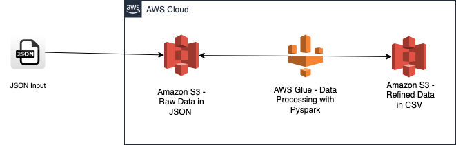

# aws-glue-json-to-csv-etl

## Visão Geral do Projeto

Este projeto demonstra a construção de um pipeline de **ETL (Extract, Transform, Load)** utilizando serviços da Amazon Web Services (AWS) para processar grandes volumes de dados no formato JSON e convertê-los para o formato CSV. A solução foi projetada especificamente para superar desafios de performance e memória que APIs tradicionais ou processamento local enfrentam ao lidar com arquivos JSON de centenas de megabytes.

**Contexto da Demanda:**
Este projeto surgiu como uma demanda do meu trabalho, onde havia a necessidade de converter arquivos JSON de logs e relatórios em um formato tabular CSV para análise. A solução existente, baseada em APIs, não era capaz de processar o volume de dados gerado.

**Dados do Projeto:**
É importante ressaltar que, devido à natureza sensível e proprietária dos dados da empresa, os **dados reais não foram incluídos neste repositório GitHub**. No entanto, a **estrutura dos dados de entrada e a transformação esperada podem ser claramente observadas** através dos [arquivos de exemplo fornecidos na pasta `data_example/`](data_example/).

**Conceito de ETL:**
ETL é uma sigla para **Extract, Transform, Load (Extrair, Transformar, Carregar)**. É um processo fundamental na engenharia de dados, onde:
* **Extract (Extrair):** Dados são coletados de uma fonte (neste caso, arquivos JSON no Amazon S3).
* **Transform (Transformar):** Os dados são convertidos de seu formato original (JSON aninhado) para um formato adequado para análise (CSV tabular), passando por limpeza, reestruturação e formatação (como datas).
* **Load (Carregar):** Os dados transformados são movidos para um destino final (neste caso, arquivos CSV no Amazon S3 para entrega ao cliente).

**O Desafio:**
O cliente possuía arquivos JSON de logs e relatórios, com tamanhos consideráveis (variando de **20 MB a mais de 950 MB** por arquivo, totalizando mais de 2 GB de dados brutos). A tentativa de processar esses arquivos localmente ou via APIs tradicionais falhava devido a **limitações de memória (Out-of-Memory)** e tempo de processamento excessivo, inviabilizando a conversão para CSV.

## Tecnologias Utilizadas

* **Amazon S3:** Serviço de armazenamento de objetos escalável e de baixo custo, utilizado como fonte para os arquivos JSON brutos e destino para os CSVs processados.
* **AWS Glue:** Serviço de ETL serverless e totalmente gerenciado, construído sobre o Apache Spark. Foi a ferramenta escolhida para a extração, transformação e carga dos dados devido à sua capacidade de processar grandes volumes de dados de forma distribuída.
* **Apache Spark (via PySpark):** O motor de processamento distribuído subjacente ao AWS Glue. Utilizado para escrever o código Python (PySpark) que orquestra a leitura, a transformação e a escrita dos dados em escala.
* **Python:** Linguagem de programação principal utilizada no script do AWS Glue.
* **Draw.io (diagrams.net):** Ferramenta utilizada para criar o diagrama de arquitetura do pipeline.

## Arquitetura do Pipeline

A arquitetura do pipeline de ETL é visualizada no diagrama abaixo, ilustrando o fluxo de dados do Amazon S3, processados pelo AWS Glue, e carregados de volta para o Amazon S3.

**Fluxo Detalhado de Processamento:**

1.  **Extract (Extração - Manual e S3):**
    * Os arquivos JSON brutos de entrada (ex: `resultado2022.json`, `resultado2023.json`, etc.) são enviados **manualmente** para uma pasta designada no Amazon S3 (ex: `s3://etl-json-project-raw-json/`).
    * O Amazon S3 atua como um data lake, fornecendo o armazenamento escalável necessário para esses arquivos grandes que não poderiam ser processados localmente.

2.  **Transform (Transformação - AWS Glue & PySpark):**
    * Um Job de ETL no **AWS Glue**, configurado como um trabalho Spark e escrito em **PySpark**, é o coração do processo de transformação.
    * Este Job é executado **manualmente** a partir do console do AWS Glue.
    * O script PySpark lê os arquivos JSON diretamente do S3. Ele é otimizado para:
        * Lidar com a leitura de JSONs grandes, incluindo aqueles que se estendem por múltiplas linhas (`option("multiline", "true")`).
        * Achatar estruturas aninhadas (como o array `history` dentro do JSON), transformando-as em linhas e colunas tabulares.
        * Selecionar apenas os campos relevantes para a saída final (ex: `department_name`, `created_on`, `user_name`, `location`).
        * Formatar campos de data e hora para o padrão brasileiro (`DD/MM/YYYY HH:MM:SS`).

3.  **Load (Carga - S3):**
    * Após a transformação, o AWS Glue salva os dados processados de volta no Amazon S3, em uma pasta designada para os arquivos CSV (ex: `s3://etl-json-project-raw-json/processed_csv/`).
    * Para garantir que cada arquivo JSON de entrada gere um único arquivo CSV de saída (facilitando a entrega), o script utiliza `.repartition(1)` antes da escrita.

## Natureza do Pipeline (Semi-Manual)

Este pipeline foi especificamente desenvolvido para uma **execução única e sob demanda**. As etapas de ingestão (upload para S3), execução do Job de ETL no Glue e a etapa final de entrega (download do S3 e envio ao cliente) são realizadas **manualmente**. A parte central de processamento de dados em escala é automatizada pelo AWS Glue e Apache Spark.

## Arquivos de Exemplo

Para facilitar a compreensão da estrutura dos dados de entrada e saída, e para permitir a demonstração da funcionalidade do pipeline, fornecemos arquivos de exemplo:

* **`data_example/json_example.json`**: Um pequeno arquivo JSON que representa a estrutura dos dados brutos de entrada, **refletindo o tipo de dados processados no projeto**.
* **`data_example/csv_example.csv`**: O arquivo CSV correspondente, mostrando a estrutura dos dados após o processamento e a conversão para CSV, refletindo as colunas e o formato de data/hora final.

Esses arquivos demonstram o formato `antes` e `depois` da transformação.

## Como Rodar o Projeto

1.  **Configuração na AWS:**
    * Crie um bucket S3 (ex: `etl-json-project-raw-json`).
    * Faça upload dos arquivos JSON de entrada **válidos** (como os da pasta `data_example/` ou seus JSONs `resultado2024.json`, `resultado2025.json`, `resultado2025V2.json`, etc) para o seu bucket.
    * Crie uma IAM Role com as seguintes permissões necessárias para o AWS Glue operar:
        * **Permissões de Serviço AWS Glue:** A política gerenciada `AWSGlueServiceRole` deve ser anexada à função. Esta política concede as permissões básicas que o AWS Glue precisa para criar e executar jobs.
        * **Permissões de Acesso ao S3:** A função precisa de permissões para:
            * **Leitura (GetObject):** Nos buckets e pastas onde seus JSONs de entrada estão (ex: `s3://etl-json-project-raw-json/raw_data/`).
            * **Escrita (PutObject, DeleteObject):** Nos buckets e pastas onde o Glue irá gravar os CSVs de saída (ex: `s3://etl-json-project-raw-json/processed_csv/`) e onde ele armazenará arquivos temporários (ex: `s3://seu-bucket-de-scripts-glue/temp/`). Para simplificar em ambientes de desenvolvimento/portfólio, a política gerenciada **`AmazonS3FullAccess`** pode ser utilizada, concedendo acesso total ao S3. Em ambientes de produção, no entanto, recomenda-se o uso de políticas mais restritivas e específicas (Princípio do Menor Privilégio).
        * **Permissões de Logs:** O Glue precisa gravar logs de execução no Amazon CloudWatch Logs. As permissões para `logs:CreateLogGroup`, `logs:CreateLogStream`, `logs:PutLogEvents` são essenciais e geralmente já estão incluídas na `AWSGlueServiceRole` ou são adicionadas automaticamente ao criar a role de Glue.
2.  **AWS Glue Job (`json-to-csv-data-processor`):**
    * No console do AWS Glue, vá para "ETL Jobs" e clique em "Create Job".
    * Selecione "Script editor" e clique em "Create".
    * Na seção **"Script path"**, selecione a opção **"Upload file to S3"** e faça o upload do seu script `aws_glue_job/json_to_csv_processor.py` diretamente do seu computador. O Glue se encarregará de armazená-lo no S3 e usar o caminho correto.
    * Preencha os detalhes restantes do Job:
        * **Name:** `json-to-csv-data-processor`
        * **IAM role:** A Role criada.
        * **Type:** `Spark`
        * **AWS Glue version:** `Glue 5.0` (ou a versão mais recente).
        * **Python version:** `Python 3`.
        * **Temporary directory:** Um caminho S3 para arquivos temporários (ex: `s3://seu-bucket-de-scripts-glue/temp/`).
        * **Number of workers:** `2` (para 2 DPUs).
        * **Job timeout:** `30 minutes`.
    * Crie o Job.
3.  **Execução do ETL:**
    * No console do AWS Glue, selecione o Job `json-to-csv-data-processor`.
    * Clique em "Run job".
    * Monitore o progresso na aba "Runs" e verifique os logs no CloudWatch para acompanhar o processamento.
4.  **Download e Entrega Final:**
    * Após o Job concluir com sucesso, vá para a pasta de saída no S3 (ex: `s3://etl-json-project-raw-json/processed_csv/`).
    * Baixe os arquivos CSV gerados.
    * Esses arquivos podem então ser compartilhados com o cliente.